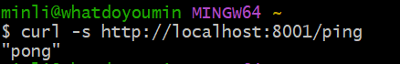
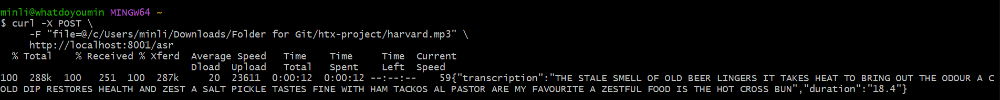

# HTX ASR Project

This repository contains the solution for the HTX Technical Test.

## Project Structure

- `asr/`: Contains the Automatic Speech Recognition (ASR) microservice and related scripts.
- `deployment-design/`: Contains the deployment architecture design document.
- `elastic-backend/`: Contains code and scripts for the Elasticsearch backend.
- `search-ui/`: Contains code and scripts for the Search UI frontend.

## Setup Instructions

(Detailed instructions will be added here as tasks are completed)

## How to Run

(Detailed instructions will be added here as tasks are completed)

## Deployment URL

(Will be updated after cloud deployment in Task 7) [cite: 39]

python -m venv venv
to activate virtual env on git bash
source ./venv/Scripts/activate

to run the server locally:
uvicorn main:app --reload

Folder Directory Summary

htx-project/
├── asr/
│   ├── Dockerfile
│   ├── .dockerignore
│   ├── asr_api.py
│   └── cv-decode.py
├── elastic-backend/
│   ├── Dockerfile
│   ├── .dockerignore
│   ├── cv-index.py
│   └── docker-compose.yml
├── search-ui/
│   ├── Dockerfile
│   ├── .dockerignore
│   └── docker-compose.yml
└── deployment-design/
    └── design.pdf

curl -X POST \
     -F "file=@/c/Users/minli/Downloads/Folder for Git/htx-project/harvard.mp3" \
     http://localhost:8001/asr
